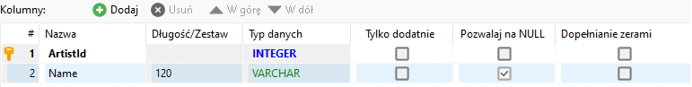

# Przygotowanie do egzaminu
Sklonuj rozwiązanie pobrane z [repozytorium](https://github.com/siwoncezary/wsei-aspnet-exam2023-sn.git). 
Wokonaj poniższe zadania uzupełniając kod w projekcie `Egzamin`. 
Potrzebne zależności, paczki są już w projekcie nie jest konieczne ich instalowanie.

Nie wolno modyfikować projektu Ezgamin2023Test! 

Nie usuwaj żadnych fragmentów z pierwotnej zawartości pliku `Program.cs`! Możesz tylko doposywać i usuwać własny kod!

Nie modyfikuj plików projektu testowego!

Oceniane są projektu, które poprawnie się uruchamiają.  

Zmodyfikuj klasę `HomeController.cs` i umieść swoje dane: imię nazwisko nr albumu we właściwości `Student` np.
```csharp
public static string Student
{
    get => "Adam Abceki 123456";
} 
```
Brak danych w tym pliku lub brak zgodności danych w pliku z kontem, na którym umieszczono wynik egzaminu,  
dyskwalifikuje projekt co skutkuje oceną niedostateczną z całego egzaminu.


# Zadanie 1
Uzupełnij obecne klasy encji, aby poprawnie opisywały poniższe tabele bazy, 

Tabela `artists` 



Tabela `albums`


W encji `Album` utwórz właściwość nawigacyjną `Artist` do encji artysty. 
Zastosuj konwencję, aby nazwy właściwości odpowiadały nazwom kolumn. Dowolną metodą wskaż nazwę tabeli, której odpowiada encja.

# Zadanie 2
Uzupełnij klasę kontekstu:
* utwórz kolekcje albumów o nazwie `Albums` i artystów `Artists`, 
* skonfiguruj bazę SQLite, aby pobierała dane z  pliku, którego ścieżka znajduje się we właściwości `DbPath`. 

# Zadanie 3
Uzupełnij klasę `MusicService` o metody:
- `GetAllArtists`, która zwraca listę wszystkich artystów
- `GetAlbumsByArtistId`, która zwraca listę albumów artysty, którego identyfikator przekazano jako argument 
W każdym albumie właściwość `Artist` musi zawierać encję artysty.

# Zadanie 4
Zdefiniuj kontroler i metodę akcji, która zostanie wywołana żądaniem GET skierowanym do ścieżki
`/Album/Index`. W odpowiedzi aplikacja powinna wysłać widok jak na rysunku poniżej:


Po wybraniu z listy nazwy artysty i kliknięciu na przycisk `Wybierz` powinno zostać wysłane
żądanie `GET` do tej samej ścieżki z identyfikatorem artysty np.:
`/Album/Index?ArtistId=2`. 

W odpowiedzi powinien pojawić się ten sam widok z formularzem i listą albumów wybranego artysty.
Wygląd nie jest istotny, ale ważne, aby lista zawierała tytuły albumów w elementach `<li>` w liście `<ul>`. 


W kontrolerze musisz pobierać dane z serwisu `MusicService`, co wiąże się z rejestracją serwisu w kontenerze i wstrzyknięciem go do kontrolera. 

# Zadanie 5
Przygotuj kontroler na zwracanie odpowiednich statusów odpowiedzi, gdy żądanie zawiera identyfikator nieistniejącego artysty np. 510000
